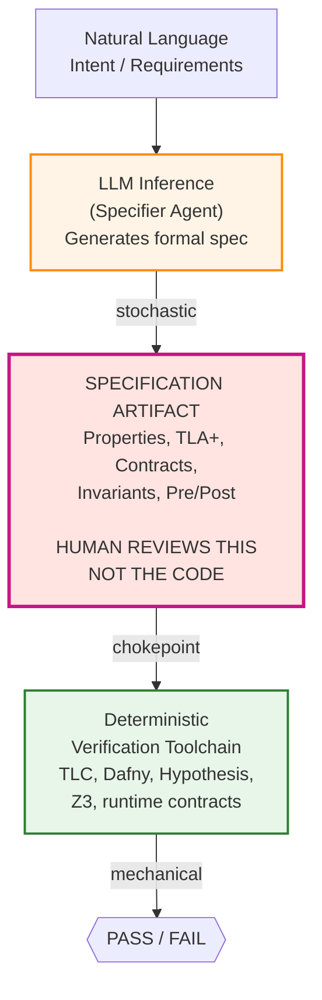
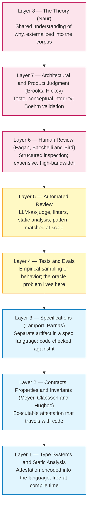
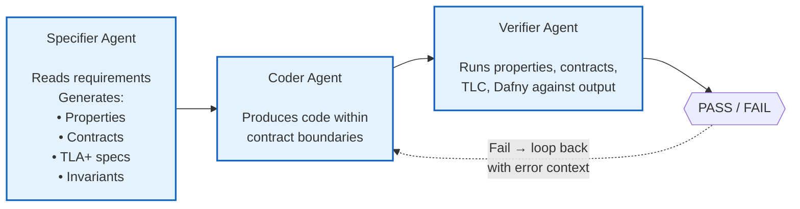
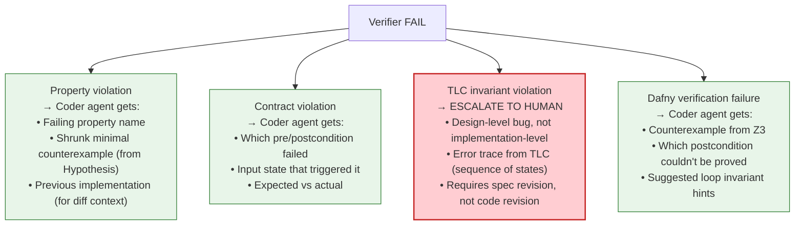
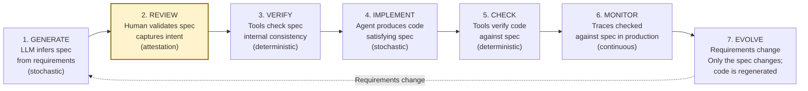

# The Attestation Layer: Architecture Specification

**Author:** Leonardo Saturnino
**Email:** lrsaturnino@gmail.com
**GitHub:** https://github.com/lrsaturnino
**X:** https://x.com/Lrsaturnino
**Repository:** https://github.com/lrsaturnino/attestation-layer
**Date:** April 2026
**Type:** Yellow paper

---

## Companion papers

1. Saturnino, L. (2026). [*Out of the Loop: A Glimpse Into the Next 15 Years of the Software Industry*](https://saturnino.substack.com/p/out-of-the-loop). Article.
2. Saturnino, L. (2026). [*The Attestation Layer: Spec-Mediated Verification for the Age of Agent-Produced Software*](https://saturnino.substack.com/p/the-attestation-layer). Article.
3. Saturnino, L. (2026). [*Software as Electricity: The Closed-Loop Attestation Architecture*](https://saturnino.substack.com/p/software-as-electricity). Article.
4. Saturnino, L. (2026). [*Wanabai: Software as Electricity*](https://github.com/wanabai/wanabai). White paper.

---

## Scope and Relationship to Companion Papers

This yellow paper formally specifies the **transitional architecture** of the Attestation Layer: the spec-mediated verification pipeline with a human chokepoint at specification review. It is the architecture that can be built with today's tooling, today's skill distribution, and today's regulatory tolerance for automation. It is the version of the stack that should be implemented over the 2026-2030 window.

It is *not* the steady-state architecture. The steady state — where the build loop and the verify loop fuse into a single continuously-running process, humans exit the main loop entirely, and software becomes a metered utility — is described in the [*Wanabai* white paper](https://github.com/wanabai/wanabai). Wanabai is not the subject of this specification; it is the target architecture that the transitional spec evolves toward once the chokepoints dissolve (approximately 2028-2032).

The two architectures are deliberate bookends, not mirrors of the same system. The transitional architecture has a human reviewer inside the main loop at the spec-review chokepoint; Wanabai has four human oversight roles outside the main loop. The transitional architecture is a linear spec → verify pipeline; Wanabai is a twelve-stage continuously-running loop with sandbox containment, adversarial outcome testing, and self-improvement. The two architectures are correct for different moments in the transition.

Readers implementing the Attestation Layer today should follow this specification. Readers designing the institutional framework for the 2030s should additionally read the [*Wanabai* white paper](https://github.com/wanabai/wanabai). The companion articles [*The Attestation Layer: Spec-Mediated Verification for the Age of Agent-Produced Software*](https://saturnino.substack.com/p/the-attestation-layer) (transitional) and [*Software as Electricity: The Closed-Loop Attestation Architecture*](https://saturnino.substack.com/p/software-as-electricity) (steady-state) describe the economic and historical context for this two-stage evolution.

**Migration path to the steady state.** The evolution from this transitional architecture to Wanabai happens in four sequential steps, each documented in the companion papers:

1. The human spec-review chokepoint dissolves into three distinct exception classes — spec contradiction, outcome mismatch, novel situation — described in the Exception-Handler Model section of [*Software as Electricity*](https://saturnino.substack.com/p/software-as-electricity). Spec review becomes an exception rotation scaling with the *exception rate*, not the production rate.
2. The linear spec-then-verify pipeline fuses into a continuous twelve-stage loop with no internal human gates — described in the Closed Loop section of [*Software as Electricity*](https://saturnino.substack.com/p/software-as-electricity) and in the Production Loop section of the [*Wanabai* white paper](https://github.com/wanabai/wanabai).
3. Blast-radius containment (sandboxing of every artifact's read/write/network/resource/effect scope) and adversarial outcome testing against *declared intent* (not just declared spec) are introduced — see the Blast Radius Containment and Adversarial Outcome Testing sections of the [*Wanabai* white paper](https://github.com/wanabai/wanabai).
4. Canonical resolution rules automate the contradiction-handling that humans performed at the transitional review gate, and self-improvement against a meta-verification suite is added under constitutional audit — see the Canonical Resolution and Self-Improvement sections of the [*Wanabai* white paper](https://github.com/wanabai/wanabai).

The migration window is approximately 2028-2032, coinciding with Chokepoint Dissolution in the timeline tables of [*Out of the Loop*](https://saturnino.substack.com/p/out-of-the-loop) and [*Software as Electricity*](https://saturnino.substack.com/p/software-as-electricity). Before that window, operators should implement the transitional architecture specified here. After it, they should run an architecture of the shape Wanabai describes.

---

## Key Terminology

The yellow paper uses a small set of load-bearing terms drawn from the wider series. Brief in-paper definitions follow so that this specification is self-sufficient for a standalone implementer; the companion papers deepen each term in its own argumentative context.

- **The loop.** The main production-and-verification path along which a software artifact moves from intent to shipped code. In the transitional architecture specified here, the loop has a human gate at specification review; in the steady state, the gate dissolves into exception handling.
- **The corpus** (specification corpus). The set of properties, contracts, models, and verified-language artifacts under `specs/`. The corpus is the durable representation of the system's intended behavior; the implementation under `src/` is a regenerable compilation of it. The Specification Artifact as Theory Container section deepens this idea.
- **The harness.** The orchestration substrate that runs the specifier agent, the coder agent, the verifier agent, and the verification toolchain on each task. The Integration with the Agent Orchestration DAG section specifies the harness's topology.
- **The attestor.** Any process or actor — human reviewer, deterministic verifier, runtime contract, model checker — whose output is a *decision* about software rather than the software itself. The Definition section formalizes this.
- **Constitutional auditor.** The role responsible for the meta-verification that the attestation layer itself is sound — that the specifier agent's outputs faithfully encode intent, that the verifier toolchain has not regressed, that the harness has not silently bypassed a gate. The transitional architecture leaves this role implicit at the spec-review gate; the steady state externalizes it (see the Self-Improvement section of the [*Wanabai* white paper](https://github.com/wanabai/wanabai)).
- **HITL / HOTL.** Human-in-the-loop and human-out-of-the-loop. The transitional architecture is HITL at the spec-review gate; the steady state is HOTL.
- **Spec-review chokepoint.** The single human gate inside the transitional loop, at which the human reviews the specification artifact (not the code) before deterministic verification proceeds. The Spec-Mediated Verification Pipeline diagram marks this as `>>> HUMAN REVIEWS THIS <<<`.
- **Exception classes.** Three categories — spec contradiction, outcome mismatch, novel situation — into which the spec-review chokepoint dissolves once the loop closes. Defined in the Exception-Handler Model section of [*Software as Electricity*](https://saturnino.substack.com/p/software-as-electricity); mentioned here in the Migration path discussion.
- **Naur theory.** The unwritten understanding of *why* a system is the way it is, named after Peter Naur's "Programming as Theory Building" (1985). In a post-LLM production world, the theory must live in artifacts (the corpus) or it lives nowhere. The Problem Statement section names the problem; the Specification Artifact as Theory Container section develops the solution. The Theory Problem section of [*The Attestation Layer*](https://saturnino.substack.com/p/the-attestation-layer) gives the full argument.
- **Production-trust gap.** The structural gap between the rate at which agent fleets can produce software and the rate at which any process can attest the software is correct. The Problem Statement section names it and points to [*The Attestation Layer*](https://saturnino.substack.com/p/the-attestation-layer) for the full treatment; the rest of the paper specifies the architecture that closes it.

These terms recur throughout. Where the paper invokes one without re-defining it, the definition above is the operative one.

---

## Problem Statement

This specification addresses three structural problems that [*The Attestation Layer: Spec-Mediated Verification for the Age of Agent-Produced Software*](https://saturnino.substack.com/p/the-attestation-layer) develops in full. They are summarized here only to fix the premises the architecture must satisfy.

**The production-trust gap.** When agent fleets drive production cost toward zero, the bottleneck moves from producing software to knowing it is correct along three dimensions: correctness (does the output match what was intended), safety (does it avoid unintended behaviors under reachable states), and alignment (does it solve the right problem). Production and attestation, once fused inside individual developers, must now be carried by separate infrastructure.

**The judge-the-judge regress.** If attestation itself is stochastic (LLM-as-judge over LLM-produced code), it inherits the problem it was meant to solve. The regress breaks only against a non-stochastic anchor: an artifact that is deterministically checkable, small enough for human review, and expressive enough to capture intended behavior. That artifact is the specification.

**The Naur theory problem.** A program is the residue of a theory held in programmers' minds (Naur, 1985); an LLM has no such theory. In a post-LLM production world the theory must live in artifacts — the specification corpus — or it lives nowhere. The Attestation Layer is where the theory lives.

The Production-Trust Gap, Judge-the-Judge Regress, and Theory Problem sections of [*The Attestation Layer*](https://saturnino.substack.com/p/the-attestation-layer) develop each framing in full; this spec assumes them and addresses the implementation.

---

## Definition

**The Attestation Layer is the set of processes, artifacts, and roles whose output is a *decision* about software, not the software itself.** The clean delimiter: if replacing a component with a faster version yields "more software, same trust," it is production; if it yields "same software, more/less trust," it is attestation. The Attestation Layer: Definition and Delimitation section of [*The Attestation Layer*](https://saturnino.substack.com/p/the-attestation-layer) develops the definition in full.

For implementers, the following negative boundaries keep the scope unambiguous:

- **A QA department** is one organizational instantiation of a thin, late-stage subset of the layer, not the layer itself.
- **Testing** is one technique within the layer; Dijkstra's argument that testing can show the presence of bugs but never their absence applies in full force.
- **Code review** is a sub-technique — currently the dominant human-mediated part, but a small fraction of the conceptual space.
- **Formal verification** is one extreme of the verification spectrum; even when an implementation is formally proved against its spec, the harder question of whether the spec itself captures intent remains open.
- **"Human in the loop"** is not a synonym for attestation. Humans can be in production loops too; the distinguishing feature of an attestor is what the human (or tool) *decides*, not their presence.
- **LLM evals** (HELM and the broader benchmark family) are a recent, narrow instance focused on model behavior, not software behavior.

---

## Core Architecture

### The Spec-Mediated Verification Pipeline



**Key invariant:** The specification artifact is the non-stochastic anchor. Above it, inference is stochastic (LLM-generated). Below it, verification is deterministic (tool-checked). The human reviews the spec — which is small, readable, and expresses *what*, not *how*.

### The Attestation Stack (Bottom to Top)

Each layer catches a different class of error; each is cheaper and weaker than the one above. The full descriptive treatment is in the Attestation Stack section of [*The Attestation Layer*](https://saturnino.substack.com/p/the-attestation-layer). The enumeration below is load-bearing for the tier mapping that follows.



**Economics of the stack:** Move as much attestation as possible to the cheapest layer that can hold it. Accept that the top layers cannot be eliminated, only supported.

---

## Specification Tiers

### Tier 1 — Property-Based Testing (Pragmatic, Implement First)

**What it is:** Instead of writing example-based tests (`assertEqual(max([3,1,2]), 3)`), write *properties* that must hold for all inputs (`for all lists L: max(L) >= every element in L AND max(L) is in L`). A framework generates hundreds/thousands of random inputs and checks.

**Tools:**
- **Hypothesis** (Python) — mature, excellent shrinking
- **fast-check** (TypeScript/JavaScript)
- **Proptest** (Rust)
- **QuickCheck** (Haskell — the original)

**Pipeline:**
1. Specifier agent reads task requirements
2. Specifier agent generates properties (not code)
3. Human reviews properties (small, readable — ~5 minutes)
4. Coder agent produces implementation
5. Properties run against implementation
6. Pass → ship. Fail → regenerate with error context.

**Why this is Layer 1 priority:** 80% of the value for 20% of the complexity. Properties are the most practical form of specification for general-purpose software. They compose. They're fast. They directly test real code (not models). They catch edge cases that example-based tests miss.

**Limitations:** Properties don't prove correctness — they sample. A property that passes on 10,000 inputs can still fail on input 10,001. For most software, this is sufficient. For safety-critical paths, escalate to the Contracts and Invariants tier or the TLA+ Model Checking tier.

### Tier 2 — Contracts and Invariants (Embed in Code)

**What it is:** Pre-conditions, post-conditions, and class/module invariants attached to every function and module the agent produces. Checked at runtime. They travel with the code.

**Implementation pattern:**
```python
# Generated by specifier agent, reviewed by human
def transfer(sender: Account, receiver: Account, amount: int):
    # --- CONTRACTS (attestation layer) ---
    assert amount > 0, "Transfer amount must be positive"
    assert sender.balance >= amount, "Insufficient balance"
    old_total = sender.balance + receiver.balance

    # --- IMPLEMENTATION (production layer — agent-generated) ---
    sender.balance -= amount
    receiver.balance += amount

    # --- POSTCONDITIONS (attestation layer) ---
    assert sender.balance >= 0, "Sender balance went negative"
    assert sender.balance + receiver.balance == old_total, "Conservation violated"
```

**Pipeline:**
1. Specifier agent generates contracts for each module/function
2. Human reviews contracts
3. Coder agent produces implementation *within* the contract boundaries
4. Contracts checked at test time AND at runtime
5. Any contract violation = immediate failure signal

**Why this matters:** Contracts are "canaries." Even if property-based tests pass, a contract violation in staging or production catches regressions. They also serve as documentation — the contract IS the specification at the function level.

### Tier 3 — TLA+ Model Checking (Architectural Decisions)

**What it is:** Formal specification of system-level behavior as a state machine, exhaustively checked by the TLC model checker for invariant violations across all reachable states.

**When to use:** Only for the parts where a design bug is catastrophic:
- Distributed protocols and consensus mechanisms
- Concurrent state management
- Cross-service transaction flows
- Financial settlement logic
- Anything involving safety-critical operational requirements

**Pipeline:**
1. Specifier agent reads architectural requirements
2. Specifier agent generates TLA+ spec (or PlusCal)
3. Human reviews spec (mathematical but readable — Lamport designed it for engineers)
4. TLC model checker exhaustively explores state space
5. If invariant violations found → spec is wrong or design is wrong → fix before any code is written
6. Verified spec becomes the oracle for the property-based tier

**Key insight from AWS:** Engineers learned TLA+ from scratch and got useful results in 2-3 weeks. The investment in formal specification was both more reliable AND less time-consuming than informal proofs. Seven AWS teams used TLA+ on critical services including DynamoDB and S3.

**State space management:** TLC explores all reachable states up to a bound. For large systems, the state space can be enormous. Typical mitigation: model at a higher abstraction level (model *what*, not *how*), constrain constants (e.g., 3 nodes instead of 100), use symmetry sets.

### Tier 4 — Verification-Aware Intermediate Language (Experimental)

**What it is:** Route agent-produced code through a verification-aware language that proves correctness against specifications at compile time, then compile to the target language. Two mature options sit at the opposite ends of the automation-expressiveness spectrum: **Dafny** (auto-active, SMT-driven, most proofs automatic) and **Lean 4** (tactic-based, dependent types, proofs written explicitly).

**The Dafny-as-IL pattern (shallow-and-wide):**
1. LLM generates code in Dafny (not the target language)
2. Dafny's verifier (backed by Z3 SMT solver) proves the code satisfies its pre/postconditions
3. If verification fails → regenerate with counterexample
4. If verification succeeds → compile Dafny to target language (C#, Go, Python, Java, JS)
5. User never sees Dafny — they see the spec and the output

**The Lean-as-IL pattern (narrow-and-deep):**
1. LLM generates code in Lean 4, including the propositions the code must satisfy
2. Tactic-based proofs discharge the propositions — either agent-written or agent-guided against a tactic library
3. Lean's kernel checks each tactic application; no SMT-trust assumption
4. If verification succeeds → Lean compiles to native code directly, or acts as a specification that a coder agent compiles to the target language
5. The cumulative proof library (mathlib-style) grows over time and becomes a shared corpus of attested content

**When to pick which:** Dafny favors shallow-and-wide verification obligations — many theorems, each relatively simple, where SMT automation handles most proofs. Lean 4 favors narrow-and-deep obligations — few theorems, each algorithmically substantial, where dependent types make the proposition expressible and tactic proofs make the argument explicit. Cryptographic primitives, verified compilation, and authorization policies typically favor Lean; API-level function correctness, data structure invariants, and protocol-level state checks typically favor Dafny.

**Current state (2025-2026):** DafnyBench (Loughridge et al., 2025) measures the best LLMs at ~68% success rate on auto-generating Dafny annotations. Lean-side progress is driven by AlphaProof (DeepMind, 2024), which demonstrated LLM-driven tactic generation at silver-medal IMO performance, and by LeanDojo (Yang et al., 2023), which established retrieval-augmented infrastructure for LLM-Lean research. Neither side is production-ready for general code verification, but both are viable for critical paths with dedicated prompt engineering and tactic-library curation.

**When to use:** When you need mathematical proof of correctness, not just empirical evidence. Financial calculations, cryptographic operations, safety-critical logic, verified compilers, authorization policy engines.

### Tier 5 — Trace Verification (Runtime/Production)

**What it is:** Capture execution traces from running systems and check that observed behaviors are allowed by the TLA+ spec from the TLA+ Model Checking tier.

**Why this exists:** You can't model-check the production system directly (too many states). But you can check that every *observed* behavior is consistent with the verified model. This catches implementation bugs that weren't caught at build time, and environmental conditions that weren't modeled.

**Pipeline:**
1. Running system emits structured trace logs
2. Trace verifier replays traces against TLA+ spec
3. Any disallowed behavior → alert + investigation
4. Over time, traces form a regression corpus

---

## Integration with the Agent Orchestration DAG

### Agent Topology

The Attestation Layer introduces two new agent roles into the orchestration DAG:



### Human Review Points

The human intervenes at exactly one point: **reviewing the specification**, not the code. This is Lamport's bet: specifications are orders of magnitude smaller, more readable, and more meaningful than implementations.

Human review cadence:
- **Properties (property-based tier):** Every task. ~5 minutes per task. Highest ROI review.
- **Contracts (contracts and invariants tier):** Every module boundary. ~10 minutes per module.
- **TLA+ specs (TLA+ model checking tier):** Only for architectural decisions. ~1-2 hours per spec. Infrequent but high-stakes.
- **Dafny specs (verification-aware language tier):** When available. Machine-verified, human spot-checked.

### Feedback Loops



### Workflow Definition (YAML)

```yaml
name: attestation-layer-pipeline
description: Spec-mediated verification for agent-produced code

steps:
  - id: specify
    type: agent
    model: claude-opus
    role: specifier
    inputs:
      - requirements
      - existing_contracts  # from previous iterations
    outputs:
      - properties          # Hypothesis/fast-check properties
      - contracts           # pre/post conditions
      - tla_spec            # only if architectural (optional)

  - id: human-review
    type: gate
    description: Human reviews specification artifacts
    requires:
      - specify.properties
      - specify.contracts
    approval: manual

  - id: implement
    type: agent
    model: claude-sonnet
    role: coder
    inputs:
      - specify.properties
      - specify.contracts
      - requirements
    outputs:
      - source_code

  - id: verify
    type: script
    command: |
      # Run property-based tests
      pytest --hypothesis-seed=random -x tests/properties/
      
      # Check contracts (runtime assertions enabled)
      pytest --contract-check -x tests/integration/
      
      # If TLA+ spec exists, run trace verification
      if [ -f specs/*.tla ]; then
        java -jar tla2tools.jar -modelcheck specs/model.cfg
      fi
    inputs:
      - implement.source_code
      - specify.properties
      - specify.contracts

  - id: retry-or-ship
    type: tool
    description: Route based on verification result
    on_success: ship
    on_failure:
      retry: implement
      max_retries: 3
      context:
        - verify.error_output
        - verify.counterexample
```

---

## Specification Language Selection Guide

The six languages and frameworks worth evaluating for the Attestation Layer cover a wide automation-versus-expressiveness spectrum. Each is profiled below in a uniform shape: what it checks, what it costs to learn and to operate, what kind of code or model it works on, and where it fits in the implementation roadmap.

**Hypothesis (and the property-based-testing family).** Property-based testing is the entry point. Learning curve is one to two days for a working developer; the framework runs randomized sampling automatically and shrinks failing inputs to minimal counterexamples. It checks behavioral properties of real code at runtime, not models, and is therefore non-exhaustive — a property that passes on 10,000 generated inputs can still fail on input 10,001. It is the right default for general application logic and the highest-priority tier to implement first. Agent-generation of properties is mature today.

**Contracts (Design by Contract, runtime assertions).** Contracts have the lowest learning curve of any tier — they are pre- and post-conditions in the host language. They are enforced at runtime, so they are non-exhaustive in the same sense as properties: a contract violation only registers when the offending code path executes. They work on real code, are best deployed at API boundaries and module interfaces, and are agent-generatable today. Implement them after properties.

**TLA+ (and the TLC model checker).** TLA+ has a medium learning curve — AWS engineers got useful results in two to three weeks from a standing start. It checks design-level invariants over all reachable states of a model and is exhaustive within the configured bound, but it does not check real code; the model is a separate artifact. It is the right tool for distributed protocols, consensus mechanisms, and concurrent state management — anywhere a design bug is catastrophic. Agent-generation of TLA+ is partially viable today (Cheng et al., 2025) and is the third tier to implement, scoped to critical paths.

**Dafny (auto-active, SMT-driven verification).** Dafny has a medium-to-high learning curve. It produces machine-checked mathematical proofs of implementation correctness against pre- and post-conditions, with most proofs discharged automatically by the Z3 SMT solver. It compiles to a target language (C#, Go, Python, Java, JS), so the verification is on real code that ships. It is the right fit for shallow-and-wide verification obligations — many theorems, each relatively simple — and for critical algorithms and financial logic. Agent-generation is partially viable: best LLMs reach about 68% success on DafnyBench (Loughridge et al., 2025).

**Lean 4 (tactic-based, dependent-type verification).** Lean 4 has the highest learning curve of any tier — three months or more for full fluency, longer to write idiomatic proofs against a project's tactic library. It produces kernel-checked proofs with no SMT-trust assumption and supports dependent types, which makes propositions expressible that no other tier can state. It compiles to native code directly or serves as a specification that a coder agent compiles to the target language. It is the right fit for narrow-and-deep verification obligations — few theorems, each algorithmically substantial — including cryptographic primitives, verified compilation, authorization policies, and cumulative domain-specific proof libraries. Agent-generation is at the emerging frontier (AlphaProof 2024; LeanDojo 2023).

**Alloy (lightweight finite-model finding).** Alloy has a medium learning curve. It checks structural constraints on data models — exhaustively within a bounded scope — using auto-active finite-model finding. Like TLA+, it checks models, not real code. It is the right fit for data-model schemas, access-control policies, and API design exploration where the question is whether the model itself is consistent and complete. Agent-generation is partially emerging.

**Implementation priority across the spectrum.** Properties are tier one and ship first. Contracts are tier two. TLA+ is tier three, scoped to critical paths. Dafny and Lean 4 are both tier four, deployed by component profile: Dafny for shallow-and-wide, Lean 4 for narrow-and-deep. Alloy is an alternative to TLA+ when the question is structural rather than temporal. The Implementation Roadmap section gives the calendar shape.

---

## The Specification Artifact as Theory Container

### What Naur's Theory Looks Like as an Artifact

The specification artifact, fully populated across tiers, becomes the *externalized theory* — the answer to "why is this system the way it is":

```
project/
├── specs/
│   ├── properties/           # What must always be true
│   │   ├── transfer.py       # Properties for transfer module
│   │   ├── settlement.py     # Properties for settlement
│   │   └── ...
│   ├── contracts/            # Module boundaries
│   │   ├── api_contracts.py  # Pre/post for every public API
│   │   ├── state_invariants.py
│   │   └── ...
│   ├── models/               # System-level TLA+
│   │   ├── consensus.tla     # Consensus protocol spec
│   │   ├── replication.tla   # Replication invariants
│   │   └── model.cfg         # TLC configuration
│   └── verified/             # Dafny source (when applicable)
│       ├── crypto.dfy        # Verified cryptographic ops
│       └── ...
├── src/                      # Agent-produced code (derivative of specs)
└── traces/                   # Production trace logs (Tier 5)
```

**Key principle:** The `specs/` directory IS the system. The `src/` directory is a *compilation artifact* derived from it. If the specs are correct, any correct implementation is acceptable — including one generated by a different agent, a different model, or a different architecture entirely. The specs are version-controlled, diffed, and reviewed. The code is disposable.

### Specification Lifecycle



---

## Research Lineage and Intellectual Foundations

This specification inherits from the correctness lineage (Turing → Floyd → Hoare → Dijkstra → Lamport), the specification lineage (Parnas → Meyer → Claessen & Hughes), the inspection-economics lineage (Fagan, Bacchelli & Bird), the theory-building lineage (Naur), and the taste-and-conceptual-integrity lineage (Brooks, Hickey). The Intellectual Lineage section of [*The Attestation Layer*](https://saturnino.substack.com/p/the-attestation-layer) gives the full treatment; the entries relevant to the transitional architecture specified here are the AWS industrial validation of TLA+ (Newcombe et al., 2014) and the tactic-based proof-assistant line culminating in Lean 4 (de Moura & Ullrich, 2021), both of which the Specification Tiers section builds directly on.

### Emerging Research (2024-2026)

Frontier work on LLM-driven generation of attestation artifacts is the empirical basis for treating Tier 3 and Tier 4 as viable for critical paths under this architecture.

- **AutoSpec** (Liu et al., 2025) — an LLM generates formal protocol specs from natural-language RFCs; downstream testing remains deterministic, the cleanest demonstration of the stochastic-above, deterministic-below invariant.
- **Self-Spec** (Xu et al., 2025) — an LLM designs its own specification schema, disambiguating before generation; sharpens the specifier-agent role.
- **LMGPA** (Zhou & Tripakis, 2025) — language-model-guided TLA+ proof automation via recursive decomposition; advances Tier 3 toward agent-generated proofs.
- **SysMoBench** (Cheng et al., 2025) — benchmark for LLM generation of TLA+ specs for real distributed systems; empirical ground for the "partially viable" assessment of TLA+ in the Specification Language Selection Guide.
- **Dafny-as-IL** (POPL 2025) — architectural pattern of an LLM generating Dafny as opaque verification intermediate and compiling to the target language, exactly as specified in the Tier 4 verification-aware language tier.
- **DafnyBench** (Loughridge et al., 2025) — 750+ program benchmark anchoring the 68% success-rate figure for LLM Dafny generation.
- **LLM-PBT** (Tanaka et al., 2025) — LLM-generated property-based tests complementing example-based tests at a combined 81% detection rate; validates the Tier 1 approach.
- **LeanDojo** (Yang et al., 2023) — retrieval-augmented language-model infrastructure for theorem proving; foundation of the 2024-2025 LLM-Lean surge.
- **AlphaProof** (DeepMind, 2024) — silver-medal IMO performance via LLM-driven tactic generation in Lean 4; empirical anchor for the Tier 4 "emerging frontier" assessment.

---

## Success Metrics

### Layer-Level Metrics

The seven layer-level metrics measure whether the architecture is functioning as specified. Spec coverage targets 100% of public APIs having properties and contracts attached, measured by an automated scan of `specs/` against `src/`. Property detection rate targets greater than 80% of injected bugs caught by properties, measured by mutation testing — inject faults into the implementation and check whether the property suite fails. Contract violation rate in production targets less than 0.01% of requests, measured by runtime monitoring on staging and production. TLA+ spec coverage of critical paths targets 100% of distributed and concurrent protocols having a spec, measured by manual audit. Human review time per task targets less than 15 minutes — and the time is spent on specs, not code. Agent retry rate targets less than 30% of tasks needing more than one attempt, measured from pipeline metrics. Mean time to correct specification targets less than 2 hours, measured from "spec doesn't capture intent" to "spec is right."

### System-Level Metrics

Four system-level metrics measure whether the architecture is delivering on its bet. Bugs reaching production that would have been caught by the attestation layer should be zero (aspirational). The ratio of spec lines of code to implementation lines of code should be roughly 1:10 to 1:20 — specs are deliberately small. Time spent reviewing specs versus reviewing code should be greater than 90% on specs. Confidence to ship agent-produced code without manual code review should be high, backed by verification rather than by inspection.

---

## Implementation Roadmap

### Phase 1: Property-Based Testing (Weeks 1-4)
- [ ] Integrate Hypothesis (Python) / fast-check (TS) into the orchestration pipeline
- [ ] Create specifier agent prompt template for property generation
- [ ] Build property-review UI/workflow for human gate
- [ ] Implement retry loop with shrunk counterexamples
- [ ] Validate on 10 representative tasks from a representative codebase

### Phase 2: Contracts and Invariants (Weeks 5-8)
- [ ] Define contract format for Python and TypeScript modules
- [ ] Create specifier agent prompt template for contract generation
- [ ] Integrate runtime contract checking into test pipeline
- [ ] Add contract violation monitoring for staging environment
- [ ] Measure false positive rate and calibrate contract strictness

### Phase 3: TLA+ for Critical Paths (Weeks 9-16)
- [ ] Identify 3-5 critical distributed/concurrent components in the target system
- [ ] Write first TLA+ spec manually (to learn the methodology)
- [ ] Evaluate LLM-generated TLA+ specs against manual baseline
- [ ] Integrate TLC model checking into CI for spec'd components
- [ ] Begin trace verification against specs in staging

### Phase 4: Verification-Aware Language Evaluation (Weeks 17-24)
- [ ] Identify 2-3 algorithmic components suitable for verification-aware language verification
- [ ] Split by component profile:
  - Shallow-and-wide (many simple theorems, SMT-friendly): evaluate **Dafny**
  - Narrow-and-deep (few theorems, algorithmically substantial): evaluate **Lean 4**
- [ ] Evaluate LLM generation against DafnyBench (Loughridge et al., 2025) for Dafny; against LeanDojo-style benchmarks (Yang et al., 2023) for Lean
- [ ] Measure per-tool verification success rate on representative tasks
- [ ] For Lean specifically: seed a small project-specific tactic library modeled on mathlib patterns, then measure whether agent-written proofs improve against the seeded library
- [ ] If viable (>80% success for Dafny auto-active; acceptable tactic-generation rate for Lean), integrate into pipeline for critical paths
- [ ] If not viable on either end, document gaps and revisit in 6 months

### Phase 5: Continuous Attestation (Ongoing)
- [ ] Production trace verification against TLA+ specs
- [ ] Mutation testing to measure property quality
- [ ] Specification evolution workflow (requirements change → spec change → code regeneration)
- [ ] Knowledge base of verified specs as reusable attestation artifacts

---

## Open Questions

The Open Questions and Future Work section of [*The Attestation Layer*](https://saturnino.substack.com/p/the-attestation-layer) poses the conceptual problems that outlive this specification (unit of attestation, the validation gap, the optimal non-stochastic anchor, spec-as-software, spec evolution). The questions below are the implementation-level counterparts that this spec leaves open for operators.

1. **What is the right human-review cadence per tier, empirically?** The Human Review Points section states target cadences (≈5 minutes for properties, ≈10 minutes per module for contracts, 1-2 hours per TLA+ spec). These are starting estimates; a deployment at scale should measure actual review time, defect escape rate per tier, and reviewer fatigue to calibrate. The Success Metrics are the instruments; the calibration target is not yet known.
2. **Where does the specifier agent's output quality plateau per language?** Tier 1 property generation is mature; Tier 3 TLA+ is partially viable; Tier 4 Dafny sits at ~68% and Lean at the frontier. Per-project plateaus depend on prompt engineering, tactic-library seeding for Lean, and verification-feedback loop design. The Phase 4 roadmap step evaluates this for Dafny and Lean separately; analogous measurements are needed for TLA+ before promoting it beyond critical paths.
3. **What is the right escalation boundary between Tier 2 contracts and Tier 3 models?** Some module-level invariants are best expressed as runtime contracts; some are best expressed as TLA+ invariants on a state machine; the boundary is a judgment call today. A decision rule — driven by state-space size, concurrency, or blast radius — would reduce operator burden and improve per-module tier selection.
4. **What counterexample format is most effective for the Coder agent's retry?** The Feedback Loops section defines the per-tool payload (shrunk input, failing property name, contract name, TLC error trace). What format maximizes first-retry success rate is an empirical question and should be instrumented from Phase 1 onward.
5. **At what point does the transitional architecture hand off to the steady state?** The Scope and Relationship to Companion Papers section sketches a 2028-2032 migration window into Wanabai. The crossover trigger — exception-rate threshold, tier-coverage threshold, verifier-quality threshold — is not formally specified and is a question for operators approaching the handoff.

---

## Conclusion

The Attestation Layer is not a testing strategy, a QA process, or a code review workflow. It is the *infrastructure for trust* in a world where production is cheap and attestation is expensive. Its core artifact — the specification — is where the theory lives, where humans concentrate their attention, and where deterministic verification anchors the entire stack.

The bet: **review the spec, not the code. Verify the code against the spec, not against human intuition. Make the spec small enough to review, formal enough to check, and expressive enough to capture what matters. Treat code as a disposable compilation artifact derived from specs, regenerated on demand, trusted only because the specs are trusted.**

If this bet is right, it is the new shape of software production that the electrification analogy predicts — organized around the natural unit of LLM work (the spec), not around the legacy artifacts of human production (the file, the PR, the repo). And the people who build it are defining the equivalent of the factory layout that took 30 years to discover after the electric motor, except on a compressed timeline where 30 years is 3.
