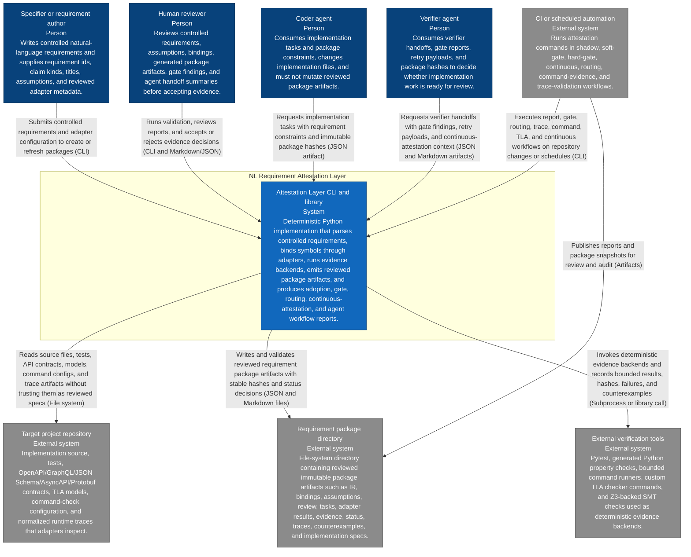
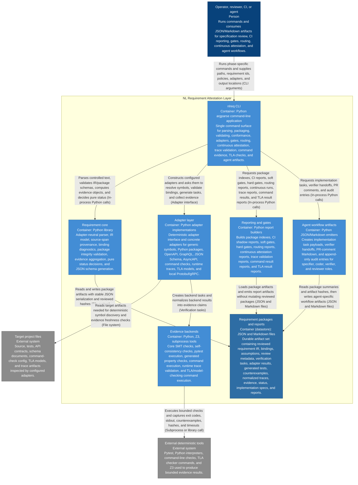
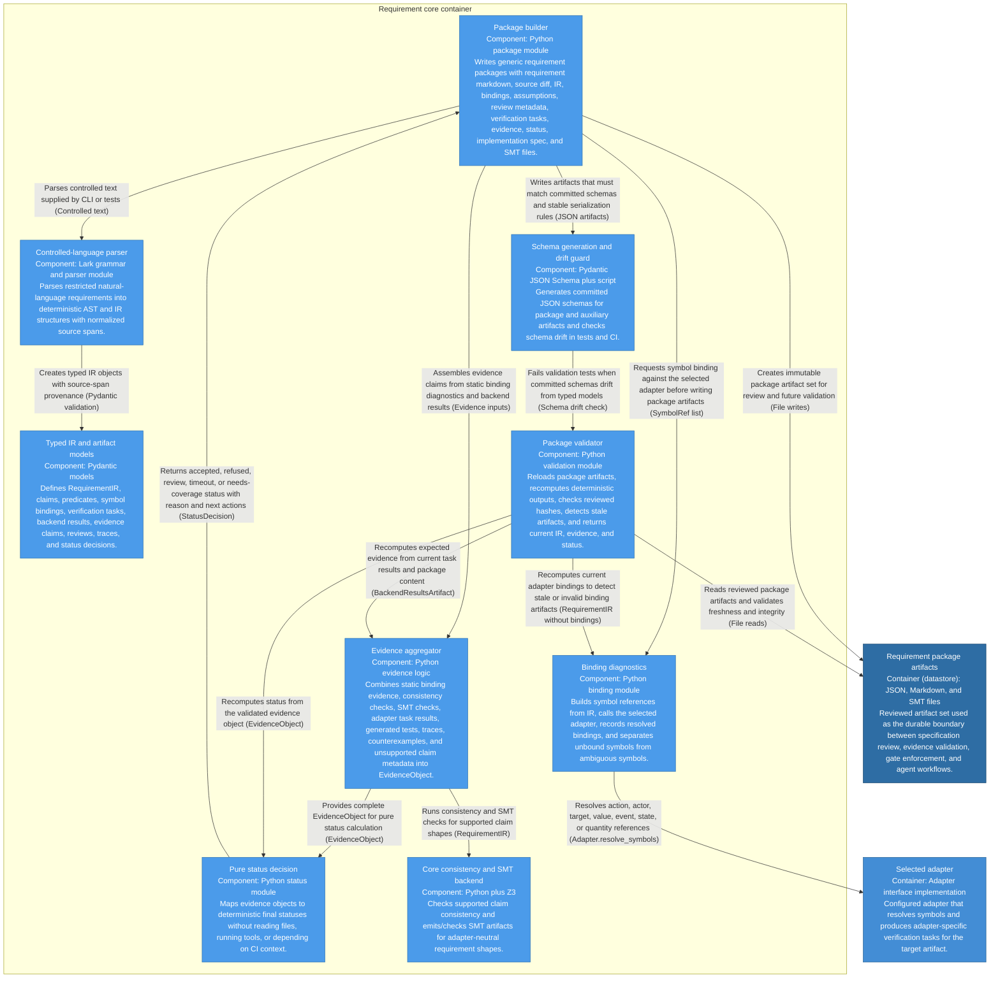
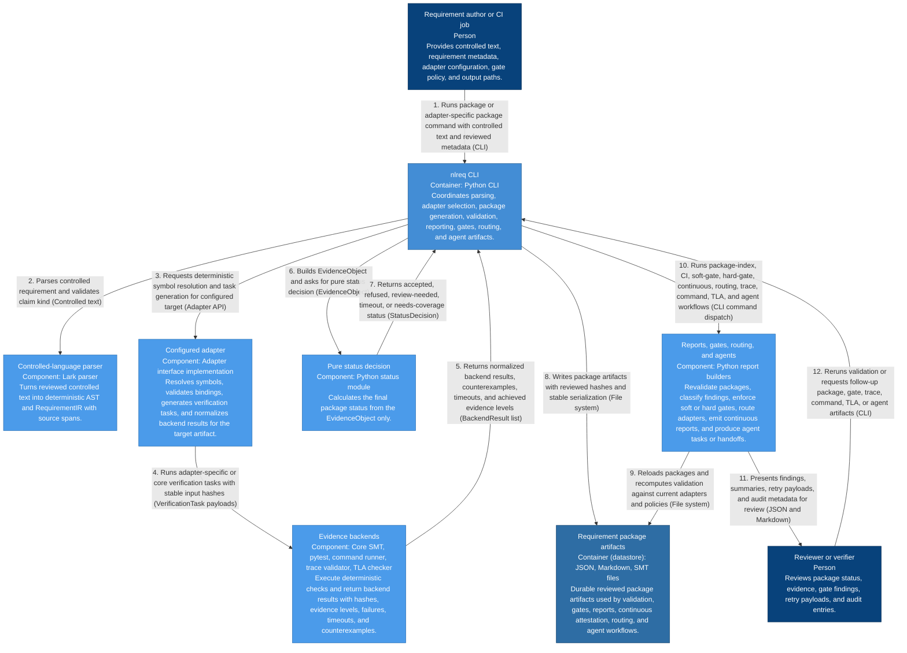

# C4 Architecture Diagrams

These diagrams describe the current NL Requirement Attestation Layer
implementation in this worktree. They cover phases 0 through 17, including the
Phase 17 Protobuf/gRPC adapter.

The diagrams follow the C4 model (system context, containers, components, and a
dynamic view) and are drawn as Mermaid flowcharts so they render inline on
GitHub. Each element box shows a name, its element type and technology where
relevant, and a description; fill colors distinguish people, systems,
containers, components, datastores, and external systems; and each relationship
has a precise label.

## Implemented Scope

| Phase | Implemented Capability | Primary Entry Points |
|---|---|---|
| 0 | Adapter-neutral parser, IR, generic adapter, package builder, schemas, SMT checks, status decisions, and conformance suite. | `nlreq parse`, `ir`, `package`, `validate`, `validate-all`, `conformance` |
| 1 | Python package adapter with deterministic symbol discovery and pytest-backed tasks. | `python-conformance`, `python-package`, `python-validate` |
| 2 | Python adapter evidence packages with adapter results and freshness checks. | `python-package`, `python-validate` |
| 3 | Adoption reporting, package indexes, CI shadow reports, and review checklist template. | `package-index`, `ci-report`, `review-template` |
| 4 | Soft gate over referenced requirements. | `soft-gate` |
| 5 | Scoped hard gate with policy and waiver evaluation. | `hard-gate` |
| 6 | Stronger backend artifacts, generated Python property checks, source hashes, counterexamples, and trace schemas. | `python-package --property-checks`, `decide-status` |
| 7 | OpenAPI declaration-level adapter and package flow. | `openapi-conformance`, `openapi-package`, `openapi-validate` |
| 8 | Continuous attestation reports, package freshness, deltas, and trace artifact ingestion. | `continuous-attestation` |
| 9 | Agent implementation tasks, verifier handoffs, PR comments, and audit entries. | `agent-task`, `agent-verify`, `agent-pr-comment`, `agent-audit` |
| 10 | Command/test-runner adapter with reviewed command checks and bounded execution. | `command-conformance`, `command-package`, `command-validate`, `command-evidence` |
| 11 | Runtime trace validation over normalized traces for supported claims. | `trace-validate`, `continuous-attestation --trace-validation` |
| 12 | Adapter registry, routing policy, and deterministic route reports. | `validate-adapter-registry`, `validate-routing-policy`, `route-adapters` |
| 13 | TLA/model-checking adapter with model/config hashes and bounded check results. | `tla-package`, `tla-validate`, `tla-check` |
| 14 | GraphQL schema adapter and package flow. | `graphql-conformance`, `graphql-package`, `graphql-validate` |
| 15 | JSON Schema adapter and package flow. | `json-schema-conformance`, `json-schema-package`, `json-schema-validate` |
| 16 | AsyncAPI adapter and package flow. | `asyncapi-conformance`, `asyncapi-package`, `asyncapi-validate` |
| 17 | Protobuf/gRPC adapter and package flow. | `protobuf-conformance`, `protobuf-package`, `protobuf-validate` |

## Level 1 - System Context

## Level 2 - Containers

## Level 3 - Core Package Components

## Level 3 - Adapter and Evidence Components

```mermaid
flowchart TB
    subgraph adapterBoundary["Adapter layer container"]
        adapterInterface["Adapter contract and conformance suite<br/>Component: Python protocol and tests<br/>Defines required adapter methods for symbol resolution, binding validation, evidence capabilities, task generation, task execution, and result collection."]:::component
        genericAdapter["Generic static-symbol adapter<br/>Component: Python dictionary-backed adapter<br/>Reference adapter for Phase 0 that resolves known symbols, exposes ambiguity fixtures, and produces static symbol evidence."]:::component
        pythonAdapter["Python package adapter<br/>Component: Python AST/import inspection plus pytest/property tasks<br/>Indexes Python modules, functions, classes, and methods; validates symbols; creates symbol, pytest, and generated property tasks with source hashes."]:::component
        openapiAdapter["OpenAPI adapter<br/>Component: JSON/YAML declaration parser<br/>Indexes paths, operations, parameters, schemas, security schemes, auth metadata, state transitions, and response declarations for declaration-level API evidence."]:::component
        graphqlAdapter["GraphQL schema adapter<br/>Component: SDL subset parser<br/>Indexes GraphQL operations, fields, principals, auth metadata, state transitions, and response declarations for declaration-level schema evidence."]:::component
        jsonSchemaAdapter["JSON Schema adapter<br/>Component: JSON document parser<br/>Indexes schemas, reviewed actions, principals, properties, states, quantities, and numeric/state declaration metadata for payload and data contract evidence."]:::component
        asyncApiAdapter["AsyncAPI adapter<br/>Component: JSON AsyncAPI parser<br/>Indexes operations, channels, messages, events, principals, and reviewed event-emission metadata for event-contract evidence."]:::component
        commandAdapter["Command/test-runner adapter<br/>Component: Reviewed command runner<br/>Links requirements to explicit command checks, hashes target and test paths, runs bounded commands, and records TEST_VALIDATED evidence or counterexamples."]:::component
        traceValidator["Runtime trace validator<br/>Component: Normalized trace validator<br/>Validates supported runtime observations over normalized traces and records TRACE_VALIDATED results only for acceptable redaction and documented claim shapes."]:::component
        tlaAdapter["TLA/model-checking adapter<br/>Component: Model config plus checker command runner<br/>Links requirements to reviewed TLA models, records model/config hashes, runs bounded checker commands, and emits BOUNDED_CHECKED evidence or counterexamples."]:::component
        protobufAdapter["Protobuf/gRPC adapter<br/>Component: Deterministic .proto subset parser<br/>Indexes schemas, messages, fields, RPCs, principals, state transitions, and reviewed RPC-level options for declaration-level gRPC evidence."]:::component
    end

    targetArtifacts["Target artifacts<br/>External system<br/>Python code, tests, OpenAPI, GraphQL, JSON Schema, AsyncAPI, Protobuf, command checks, traces, and TLA models supplied by the repository."]:::external
    testAndModelTools["Backend tools<br/>External system<br/>Pytest, Python interpreter, command-line tools, trace data, TLA checker commands, and Z3."]:::external
    packageArtifacts["Requirement package artifacts<br/>Container (datastore): JSON and Markdown files<br/>Package artifacts that store bindings, tasks, backend results, counterexamples, traces, evidence, status, and review hashes."]:::containerDb

    adapterInterface -->|"Defines behavior validated by conformance tests (Adapter API)"| genericAdapter
    adapterInterface -->|"Defines behavior validated by Python conformance tests (Adapter API)"| pythonAdapter
    adapterInterface -->|"Defines behavior validated by OpenAPI conformance tests (Adapter API)"| openapiAdapter
    adapterInterface -->|"Defines behavior validated by GraphQL conformance tests (Adapter API)"| graphqlAdapter
    adapterInterface -->|"Defines behavior validated by JSON Schema conformance tests (Adapter API)"| jsonSchemaAdapter
    adapterInterface -->|"Defines behavior validated by AsyncAPI conformance tests (Adapter API)"| asyncApiAdapter
    adapterInterface -->|"Defines behavior validated by command adapter conformance tests (Adapter API)"| commandAdapter
    adapterInterface -->|"Defines behavior validated by TLA package and checker tests (Adapter API)"| tlaAdapter
    adapterInterface -->|"Defines behavior validated by local Protobuf conformance tests (Adapter API)"| protobufAdapter

    pythonAdapter -->|"Reads Python package source and test paths to index symbols and compute source/test hashes (File system)"| targetArtifacts
    openapiAdapter -->|"Reads OpenAPI documents and resolves declaration-level operation/security/response symbols (JSON or YAML)"| targetArtifacts
    graphqlAdapter -->|"Reads GraphQL SDL and resolves declaration-level operation/field symbols (GraphQL SDL)"| targetArtifacts
    jsonSchemaAdapter -->|"Reads JSON Schema documents and resolves property/action/quantity symbols (JSON Schema)"| targetArtifacts
    asyncApiAdapter -->|"Reads AsyncAPI documents and resolves operation/message/channel/event symbols (JSON AsyncAPI)"| targetArtifacts
    commandAdapter -->|"Reads reviewed command-check configuration and target/test path hashes (JSON config and files)"| targetArtifacts
    traceValidator -->|"Reads normalized trace artifacts and requirement package metadata (JSON traces)"| targetArtifacts
    tlaAdapter -->|"Reads reviewed TLA model configuration, modules, and checker config files (TLA files and JSON config)"| targetArtifacts
    protobufAdapter -->|"Reads .proto schemas and resolves declaration-level RPC/message/option symbols (Protobuf schema)"| targetArtifacts

    pythonAdapter -->|"Runs scoped pytest and generated property tasks under deterministic task payload hashes (Subprocess)"| testAndModelTools
    commandAdapter -->|"Runs reviewed command checks with timeout and expected exit code (Subprocess)"| testAndModelTools
    tlaAdapter -->|"Runs model-checking command with reviewed bounds and expected exit code (Subprocess)"| testAndModelTools
    traceValidator -->|"Compares observed trace events with supported requirement claims and package metadata (Package and trace JSON)"| packageArtifacts
    adapterInterface -->|"Defines task, result, evidence, generated-test, counterexample, and trace artifact contracts stored by concrete adapters (JSON artifact contract)"| packageArtifacts

    classDef person fill:#08427b,stroke:#052e56,color:#ffffff
    classDef system fill:#1168bd,stroke:#0b4884,color:#ffffff
    classDef container fill:#438dd5,stroke:#2a6496,color:#ffffff
    classDef containerDb fill:#2e6da4,stroke:#1d4a70,color:#ffffff
    classDef component fill:#4b9bea,stroke:#2f74b5,color:#ffffff
    classDef external fill:#8b8b8b,stroke:#5f5f5f,color:#ffffff
```

## Dynamic View - Package, Validation, and Gate Flow

## Rendering

Render the Mermaid blocks with any Mermaid-compatible renderer such as GitHub,
the Mermaid Live Editor, or the Mermaid CLI. The diagrams use the stable
flowchart syntax with `subgraph` boundaries and `classDef` colors for C4
element types, which renders inline on GitHub (unlike Mermaid's experimental
native C4 diagram types). The diagrams intentionally keep the rendered boxes
descriptive, so they are more verbose than thumbnail architecture sketches.
