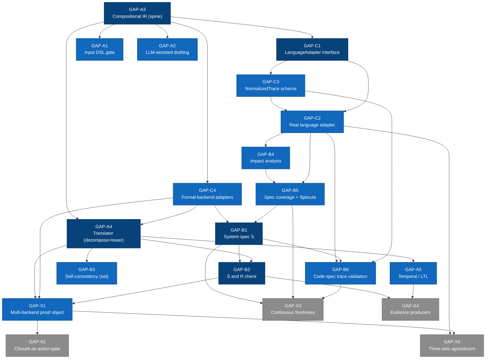

# NL Attestation Layer — Vision/Implementation Gap Specification

**Status:** Draft v1 · **Date (UTC):** 2026-05-30
**Purpose:** Specify, exhaustively, the delta between the *full vision* of the NL
Requirement Attestation Layer and the *current implementation*, so the gaps can
be decomposed into new build phases and ADRs.

## 0. How To Use This Document

This is a **gap specification**, not a build plan. It says *what is missing* and
*what each missing thing must become*; sequencing and effort estimates are left to
the phase/ADR decomposition that follows from it.

Each gap is assigned a stable ID (`GAP-A1`, `GAP-B2`, …) and uses one template:

- **Vision intent** — what the source-of-truth conversation specified.
- **Current state** — what exists today, grounded in the code.
- **The gap** — the precise delta.
- **Why it matters / unblocks** — the consequence of the gap.
- **Research/tool basis** — the prior art the vision leans on.
- **Depends on** — other gaps that must land first.
- **Acceptance-criteria sketch** — enough to scope a phase.
- **ADR seeds** — the decisions a phase must commit to.

### Sources of truth

| Artifact | Path | Role |
|---|---|---|
| Vision (the real requirements) | internal design conversation (kept local, not committed) | The full system, as designed in conversation. |
| Descoped build plan | `docs/build-plan.md`, `docs/nl-attestation-layer-build-plan.md` | The Phase-0 skeleton that was actually implemented. |
| Implementation | `src/nlreq/`, `requirements/` | What the code does today. |
| Scope/non-goals | `docs/scope.md` | Current deliberate boundaries (subset of these gaps). |

### Why the gap exists (context)

The vision (captured in an internal design conversation, kept local) specifies a prospective requirements
gatekeeper. During the plan-vetting passes in that same conversation, the design
was progressively descoped — cross-language dropped, self-consistency demoted,
the `S ∧ R` check / trace validation / Specula / Req2LTL-OnionL / LTL all
deferred — to a Phase-0 core "small enough to ship." The repository then
implemented that skeleton and expanded *horizontally* with shallow
declaration-level adapters. The architectural **shape** of the vision exists; the
verification **muscle** does not. This document specifies the muscle.

## 1. The Vision, In One Paragraph (anchor)

A system that takes a human requirement, translates it into formal logic, then
checks three things — is it self-consistent, is it consistent with the existing
system's verified behavior, and is it implementable given the current code — and
only lets it through if all three close; on failure it returns a precise,
fragment-level explanation. It is language-agnostic (the IR is the spine;
programming languages and formal backends are adapters), so a requirement
spanning a full stack can be validated as a single proof. It integrates existing
tools — Req2LTL/OnionL for translation, Apalache for the symbolic check, Specula
for brownfield spec extraction — and the contribution is the integration plus the
rule that nothing ships until the proof closes.

Vision pipeline (from the internal design conversation):

```
NL → DSL gate → translator (NL → intermediate tree → formal R)
   → self-consistency (R alone)
   → impact analysis (which modules does R touch?)
   → spec-coverage check (unspec'd? → extract spec first)
   → SYSTEM-consistency (check  S ∧ R , S = legacy's verified spec)
   → trace validation (do real code traces violate R?)
   → closure gate → approved requirement + proof object
+ continuous CI: spec freshness, trace re-validation, spec-extraction proposals
```

## 2. Architecture: What Exists vs. What Is Missing

**Built (the foundation — keep it, see §6):** controlled-language parser
(`grammar.lark`, `parser.py`), typed IR with source spans (`models.py`),
adapter interface (`adapter.py`), the full 9-level evidence taxonomy and 6 claim
kinds (`models.py`), pure status decision (`status.py`), self-consistency +
propositional SMT (`smt.py`), immutable hashed package format
(`package.py`), report-only gates (`gate.py`), routing
(`routing.py`), continuous-attestation (`continuous.py`), agent-handoff
artifacts (`agent_workflow.py`), a generic static-symbol adapter, and a set of
declaration-level adapters (Python/OpenAPI/GraphQL/JSON-Schema/AsyncAPI/Protobuf)
plus command-runner, external-TLA-checker, and runtime-trace adapters.

**Missing (the muscle — this document):** the three pillars and the connective
tissue below.

| Layer | Vision | Built today |
|---|---|---|
| Input | DSL gate + optional LLM-assisted drafting | Restricted grammar only; controlled text submitted directly; no LLM |
| Translation | NL → compositional intermediate tree → formal (LTL/TLA+/SMT) | Deterministic AST → flat typed IR; no decomposition tree, no formal lowering, no temporal |
| Self-check | ALICE-style contradiction taxonomy; conjunction of all claims | Intra-claim contradiction + propositional satisfiability of one claim |
| System-check | `S ∧ R` against the legacy's verified spec (Apalache) | None — no representation of `S`, no model checking of requirement-vs-system |
| Codebase fit | Impact analysis, spec coverage, code↔spec trace validation | None — declaration parsers only; no call graph, no Specula, no code-execution traces |
| Proof | Multi-backend dispatcher → aggregated proof object → action gate | Single `core_smt` task per claim; report-only gate |
| Agnosticism | Programming-language + formal-language + natural-language axes | Shallow: declaration adapters; one formalism (propositional Z3); controlled English only |

## 3. Gap Map (at-a-glance)

| ID | Capability | Severity | Unblocks |
|---|---|---|---|
| **GAP-A1** | Input DSL gate beyond the toy grammar | High | Expressing real requirements |
| **GAP-A2** | LLM-assisted prose → controlled drafting (provenance/approval) | High | Prose specs entering the pipeline |
| **GAP-A3** | Compositional intermediate representation (OnionL-style) | Critical | Reliable, verifiable translation |
| **GAP-A4** | Hybrid decompose + deterministic lowering to formal logics | Critical | NL → formal claim |
| **GAP-A5** | Temporal-logic / LTL support (real `bounded_temporal`) | High | Time-bounded & liveness requirements |
| **GAP-B1** | First-class representation of the existing system spec `S` | Critical | "Fit with legacy code" |
| **GAP-B2** | `S ∧ R` symbolic consistency check (Apalache) + counterexamples | Critical | The core system-consistency check |
| **GAP-B3** | Upgraded self-consistency (ALICE taxonomy; cross-requirement) | High | Catching contradictions across a requirement set |
| **GAP-B4** | Impact analysis (call-graph + semantic) | High | "Where does this requirement touch?" |
| **GAP-B5** | Spec-coverage tracking + Specula integration + gating | High | Brownfield correctness |
| **GAP-B6** | Trace validation against the actual codebase (code↔spec) | High | "Is it implementable given current code?" |
| **GAP-C1** | LanguageAdapter interface for source code | Critical | Real-codebase analysis |
| **GAP-C2** | First real source-language adapter(s) — Solidity / Go | High | A working vertical |
| **GAP-C3** | NormalizedTrace schema for code-execution traces | High | Cross-language trace reasoning |
| **GAP-C4** | Formal-backend adapters (IR → TLA+/Alloy/Lean/SMT) | High | Formalism-agnostic checking |
| **GAP-X1** | Multi-backend dispatcher + aggregated proof object | High | Multi-premise / multi-formalism closure |
| **GAP-X2** | Closure-as-action-gate | Medium | The structural-backpressure thesis |
| **GAP-X3** | Continuous CI freshness (spec staleness, re-validation, proposals) | Medium | Anti-drift |
| **GAP-X4** | Evidence-producer completeness (inductive, system-bounded) | Medium | Honest high-assurance levels |
| **GAP-X5** | Three-axis agnosticism (prog-lang / formal-lang / NL) | Medium | "Infrastructure, not a tool" positioning |

---

## 4. The Gaps

### Pillar A — NL → Formal Translation (the front door)

#### GAP-A1 — Input DSL gate beyond the toy grammar
- **Vision intent.** A constrained input DSL ("Gherkin++") that rejects vague prose at the source and maximizes reliable translation; richer than a single rule pattern.
- **Current state.** `grammar.lark` accepts one pattern (`For every … if … then … must …`) with a fixed result/condition set; vocabulary is a 7-symbol generic table (`adapter.py`).
- **The gap.** No general input DSL; expressivity is bounded to the toy grammar + toy vocabulary, so real requirements cannot be stated.
- **Why it matters.** Without a usable input surface, the rest of the pipeline has nothing real to operate on.
- **Research/tool basis.** Controlled Natural Language (CNL) input is the convergent pattern across nl2spec, ALICE, Req2LTL.
- **Depends on.** GAP-A3 (the IR the DSL targets).
- **Acceptance-criteria sketch.** A documented DSL grammar + parser that expresses a corpus of real requirements (e.g., tBTC TIPs) with refusal of under-specified inputs naming the missing part.
- **ADR seeds.** DSL grammar scope and versioning; refusal taxonomy for malformed input; relationship between DSL and IR.

#### GAP-A2 — LLM-assisted prose → controlled drafting
- **Vision intent.** Optional LLM rewrite of free-form prose into the controlled form, never auto-accepted: package preserves original, suggested, approved, diff, model/prompt metadata, timestamp, explicit approval; no parser runs until approved.
- **Current state.** The package *format* has the slots (`source-diff.md`, controlled-text approval fields), but every package records "no LLM rewrite used"; there is no draft command and no LLM/network client in the code.
- **The gap.** The drafting capability itself is absent — the front door for prose is a stub.
- **Why it matters.** This is the bridge from a human prose spec to a checkable controlled requirement; without it, only hand-written controlled text is accepted.
- **Research/tool basis.** nl2spec's bidirectional NL↔formal mapping; the convo's §4.2 LLM-rewrite protocol.
- **Depends on.** GAP-A1, GAP-A3.
- **Acceptance-criteria sketch.** A drafting step that proposes a controlled form with a side-by-side diff, requires explicit human approval, and records full provenance as first-class evidence.
- **ADR seeds.** LLM-rewrite approval protocol; provenance schema; trust boundary (LLM drafts, never decides).

#### GAP-A3 — Compositional intermediate representation (OnionL-style)
- **Vision intent.** An intermediate representation that decomposes a requirement into a compositional tree of semantic scopes, logical relations, and atomic propositions (OnionL), enabling structured, verifiable translation; the IR is the **spine** of the whole system.
- **Current state.** `models.py` defines a flat typed claim (one claim kind + condition list + expected result). It is typed, versioned, hashable — but not a compositional decomposition tree.
- **The gap.** No hierarchical semantic decomposition; the IR cannot represent the structure needed for reliable NL→formal translation or for projecting into multiple formal backends.
- **Why it matters.** The convo names the IR as the single most consequential design decision; an IR that secretly favors one backend or cannot express real requirements caps the entire system.
- **Research/tool basis.** Req2LTL/OnionL (Ma et al, 2025); VERIFYAI JSON-LD IR; the convo's IR-must-express list (entities, state, actions w/ pre/post, invariants, temporal, quantifiers, numeric/logical, external-context refs, provenance, confidence markers).
- **Depends on.** none (foundational).
- **Acceptance-criteria sketch.** An IR spec + schema that expresses a multi-premise, cross-cutting requirement and projects cleanly into at least two formal backends without backend-specific escape hatches in the spine.
- **ADR seeds.** IR core notation (sequent/typed-lambda vs. tree); extension-point mechanism for backend annotations; partial-specification semantics; provenance + confidence model; migration policy from the current flat IR.

#### GAP-A4 — Hybrid decompose + deterministic lowering to formal logics
- **Vision intent.** Two-stage translation: LLM does hierarchical semantic decomposition into the IR; a deterministic, rule-based translator lowers the IR into formal logic, with bidirectional NL↔formal mapping for clarification and multi-pass disagreement detection (disagreeing translations ⇒ refuse + ask).
- **Current state.** Deterministic AST→IR lowering only; no LLM decomposition, no formal-logic lowering, no multi-pass disagreement gating.
- **The gap.** The translator — the heart of "NL requirement → formal claim" — does not exist.
- **Why it matters.** This is what turns a stated requirement into something a checker can reason about.
- **Research/tool basis.** Req2LTL/OnionL two-stage architecture; nl2spec bidirectional mapping; "treat the translator as untrusted, gate it with deterministic checks."
- **Depends on.** GAP-A3 (IR), GAP-C4 (formal backends to lower into).
- **Acceptance-criteria sketch.** Given a controlled/decomposed requirement, produce a formal claim; multiple independent translations are checked for equivalence; disagreement yields a structured clarification rather than a silent choice.
- **ADR seeds.** Translation trust model; equivalence-check method; clarification-loop protocol; which formalism is the default lowering target.

#### GAP-A5 — Temporal-logic / LTL support
- **Vision intent.** Express and check temporal/bounded-time properties (LTL, TLA+ temporal); the `bounded_temporal` claim kind must be genuinely checkable.
- **Current state.** `models.py` declares the `bounded_temporal` claim kind, but the core SMT backend (`smt.py`) is propositional Z3; there is no temporal engine. Temporal checking is only reachable by handing the external-TLA-checker adapter a human-written reviewed model.
- **The gap.** No NL→LTL/temporal translation and no in-pipeline temporal reasoning; the declared temporal claim kind has no real producer.
- **Why it matters.** Time-bounded and liveness requirements (e.g., "redemption completes within 6h") are central to the target domain and unrepresentable today.
- **Research/tool basis.** Req2LTL (NL→LTL); TLA+ temporal; Apalache/TLC for bounded temporal checking.
- **Depends on.** GAP-A3, GAP-A4, GAP-C4.
- **Acceptance-criteria sketch.** A temporal requirement is translated to a formal temporal claim and checked, producing `BOUNDED_CHECKED(k)` with recorded bounds, or a counterexample.
- **ADR seeds.** Temporal formalism choice (LTL vs. TLA+ temporal vs. both); bound/budget policy; evidence-level semantics for temporal results.

### Pillar B — System-Consistency Against a Verified Spec (the core)

#### GAP-B1 — First-class representation of the existing system spec `S`
- **Vision intent.** The legacy system's verified formal model `S` is a first-class input the new requirement `R` is checked against; this is what makes requirements "fit with legacy code."
- **Current state.** No concept of an existing system spec anywhere in the code; each requirement is attested in isolation. The TLA adapter links a requirement to a reviewed *model*, but there is no notion of *the system's* spec `S` that requirements are checked against.
- **The gap.** Without `S`, the central "consistent with the existing verified system" check cannot exist.
- **Why it matters.** This is the user's stated core requirement and a named novel contribution.
- **Research/tool basis.** TLA+ specs (category-4 formal models); Specula (to obtain `S` for brownfield); the convo's `S ∧ R` framing.
- **Depends on.** GAP-C4 (formal representation), GAP-B5 (how `S` is obtained/kept fresh).
- **Acceptance-criteria sketch.** A registry binding system modules to their formal specs `S`, with versioning and freshness, that the system-consistency check consumes.
- **ADR seeds.** What counts as `S` (TLA+ only vs. multi-formalism); per-module spec registry format; freshness/versioning of `S`.

#### GAP-B2 — `S ∧ R` symbolic consistency check
- **Vision intent.** Check satisfiability of `S ∧ R` with a symbolic model checker (Apalache); on violation, return a concrete counterexample naming exactly which invariant, states, and actions break; on timeout, mark `unverified` (never silently approve).
- **Current state.** The SMT backend (`smt.py`) runs propositional Z3 on a *single requirement in isolation* (`smt2_for_ir`), checking self-satisfiability of one claim. No `S`, no `S ∧ R`, no model checking. The TLA adapter can invoke `apalache` as a command but only against a human-supplied reviewed model, not as an `S ∧ R` engine.
- **The gap.** The core system-consistency check does not exist; the existing "SMT" is a different, far narrower thing.
- **Why it matters.** This is the mechanism that decides whether a new requirement contradicts the verified system.
- **Research/tool basis.** Apalache symbolic model checking (SMT/Z3-backed), counterexample extraction; bounded model checking; verification-budget discipline.
- **Depends on.** GAP-B1 (`S`), GAP-A4 (formal `R`), GAP-C4, GAP-X4 (evidence semantics).
- **Acceptance-criteria sketch.** Given `S` and a formal `R`, return satisfiable / counterexample-with-named-invariant / timeout-as-unverified, with recorded bounds and reproducibility metadata.
- **ADR seeds.** Checker choice (Apalache primary, TLC/TLAPS reserve); verification-budget policy; counterexample artifact schema; handling of timeouts as a first-class non-approving status.

#### GAP-B3 — Upgraded self-consistency (ALICE-style; cross-requirement)
- **Vision intent.** Detect contradictions *within* a requirement and *across a requirement set* using an ALICE-style contradiction taxonomy + formal logic; conjunction of all claims' conditions is checked for internal contradiction before dispatch.
- **Current state.** `smt.py` detects direct contradictions within a *single* claim's condition list, and checks one claim's satisfiability. There is no cross-requirement / conjunction-of-claims check (a contradiction between requirement A and requirement Z is not detected).
- **The gap.** No requirement-set consistency and no contradiction taxonomy; the self-check is per-claim only.
- **Why it matters.** Decomposing a feature into many small requirements gives no protection against the parts mutually contradicting.
- **Research/tool basis.** ALICE (seven-question decision tree, contradiction taxonomy, CNL + formal logic hybrid).
- **Depends on.** GAP-A3, GAP-A4.
- **Acceptance-criteria sketch.** A set of requirements is checked jointly; mutually inconsistent members are flagged with the contradiction type and the conflicting fragments.
- **ADR seeds.** Contradiction taxonomy adopted; scope of "requirement set" (per feature / per module / global); how joint inconsistency is surfaced and gated.

#### GAP-B4 — Impact analysis (call-graph + semantic)
- **Vision intent.** Determine which modules a requirement touches via a deterministic layer (static call-graph from requirement symbols) cross-validated with a semantic LLM layer; union of affected modules feeds spec-coverage gating.
- **Current state.** None. Routing (`routing.py`) matches requirements to adapters by author-written path/id globs; there is no call-graph, no symbol-to-code impact analysis.
- **The gap.** The system cannot answer "what does this requirement affect in the codebase."
- **Why it matters.** Required to know which specs/traces are relevant and whether coverage exists.
- **Research/tool basis.** LSP / gopls / Slither call graphs; module dependency graphs; code-to-spec manifests; LLM impact estimation cross-validated against the deterministic layer.
- **Depends on.** GAP-C1, GAP-C2.
- **Acceptance-criteria sketch.** Given a requirement, produce an affected-module set with deterministic + semantic agreement, flagging disagreements.
- **ADR seeds.** Static-analysis tool per language; manifest format mapping code modules ↔ spec modules; disagreement-handling policy.

#### GAP-B5 — Spec-coverage tracking + Specula integration
- **Vision intent.** Track formal-spec coverage like test coverage; requirements touching unspec'd modules are blocked until a Specula-style extraction fills the gap; continuous spec-extraction proposals as reviewable PRs.
- **Current state.** None. There is a coverage-manifest concept in the build plan but no spec-coverage tracking, no Specula integration, no extraction.
- **The gap.** No way to know if the modules a requirement touches are formally specified, nor to fill gaps.
- **Why it matters.** In brownfield systems, most behavior is unspec'd; without coverage gating the system-consistency check runs against fiction or nothing.
- **Research/tool basis.** Specula (Code→TLA+ extraction + trace validation, 2025 TLA+ Foundation challenge); "spec coverage as a tracked metric."
- **Depends on.** GAP-B1, GAP-B4, GAP-C2.
- **Acceptance-criteria sketch.** A coverage metric per module; requirements blocked against under-specified modules; an extraction step that proposes spec for a module under human review.
- **ADR seeds.** Coverage metric definition + thresholds; Specula integration boundary; human-in-the-loop for accepting extracted specs.

#### GAP-B6 — Trace validation against the actual codebase
- **Vision intent.** Replay real execution traces of the current code against the formalized requirement (and against `S`) to confirm code↔spec alignment; quantify the delta (already-implemented / needs-change / coverage-gap).
- **Current state.** A runtime-trace adapter (`trace_validation.py`) validates *normalized runtime traces against a requirement's supported claims*. It does not perform Specula-style *code↔spec alignment* (does the spec reproduce the binary's traces?) and is not tied to a system spec `S`.
- **The gap.** No verification that the formal model matches what the code actually does; the existing trace step answers a different question.
- **Why it matters.** Closes the "implementable given current code" check and prevents checking against a drifted/fictional spec.
- **Research/tool basis.** Specula trace validation; the convo's "trace validation is non-negotiable."
- **Depends on.** GAP-B1, GAP-C2, GAP-C3.
- **Acceptance-criteria sketch.** For affected modules, replay current traces against `R`/`S`; classify as satisfies / violates-with-delta / no-coverage.
- **ADR seeds.** Trace source per language; classification semantics; relationship to the existing runtime-trace adapter (extend vs. separate).

### Pillar C — Real Source-Language Adapters

#### GAP-C1 — LanguageAdapter interface for source code
- **Vision intent.** A small fixed interface every programming-language adapter implements: `resolve_symbol`, `call_graph`, `validate_binding`, `present_to_llm`, `extract_traces`, `parse_manifest`. The IR + backends + dispatcher + status decision stay language-independent; everything language-specific lives above this line.
- **Current state.** The existing `Adapter` interface (`adapter.py`) is oriented to *declaration/symbol resolution + task generation* for contract-style artifacts; it has no call-graph, code-presentation, trace-extraction, or coverage-manifest methods. The built adapters parse contract files, not source code.
- **The gap.** No source-code adapter abstraction (call graph, impact, code-execution traces, manifests).
- **Why it matters.** Everything in Pillar B that touches "the codebase" needs this interface.
- **Research/tool basis.** The convo's LanguageAdapter interface; LSP as the cross-language substrate.
- **Depends on.** GAP-A3 (IR the adapters bind into), GAP-C3 (trace schema).
- **Acceptance-criteria sketch.** A documented interface + a stub/null adapter that exercises it end-to-end; a conformance suite future adapters must pass.
- **ADR seeds.** Source-LanguageAdapter interface (vs. the existing declaration-Adapter); conformance suite; relationship/coexistence of the two adapter families.

#### GAP-C2 — First real source-language adapter(s)
- **Vision intent.** Ship one real adapter (Solidity and/or Go) wrapping mature tooling: symbol resolution + call graph (Slither / gopls / LSP), trace extraction (Foundry / `runtime/trace`), code-to-spec manifest.
- **Current state.** No Solidity or Go *source* adapter. The Python adapter inspects Python AST/imports for symbol/test tasks but does not provide call-graph/impact/trace-normalization per the LanguageAdapter interface.
- **The gap.** No working source-language vertical; the keep-core (Go) class of spec cannot be analyzed at all.
- **Why it matters.** Without one real adapter, the agnostic interface is unproven and no brownfield requirement can be checked against code.
- **Research/tool basis.** Per-language tool inventory in the convo (Solidity: Slither/Foundry; Go: gopls/go-callgraph/runtime-trace).
- **Depends on.** GAP-C1, GAP-C3, GAP-B4.
- **Acceptance-criteria sketch.** For a real requirement against a real codebase, the adapter resolves symbols, returns a call graph and affected modules, and emits normalized traces.
- **ADR seeds.** First-adapter selection + rationale; tool dependencies; manifest format.

#### GAP-C3 — NormalizedTrace schema for code-execution traces
- **Vision intent.** A cross-language `NormalizedTrace`/`TraceEvent` schema (timestamp, actor, action, pre/post-state, causal predecessor, language, metadata) that EVM, native, async, and dynamic-language traces all project into.
- **Current state.** A runtime-trace schema exists for the requirement-trace adapter, but it is not the cross-language code-execution-trace schema the verification step needs, and it is not populated by source-language adapters.
- **The gap.** No shared trace schema spanning languages for verification; trace normalization (the "actually hard piece") is unaddressed.
- **Why it matters.** Trace validation (GAP-B6) and cross-language proofs (GAP-X5) depend on it.
- **Research/tool basis.** OpenTelemetry span model as the closest cross-language baseline.
- **Depends on.** GAP-C1.
- **Acceptance-criteria sketch.** A schema two structurally different languages project into without losing the data the verifier needs.
- **ADR seeds.** NormalizedTrace schema; lossy-normalization rules; relationship to the existing runtime-trace schema.

#### GAP-C4 — Formal-backend adapters (IR → TLA+/Alloy/Lean/SMT)
- **Vision intent.** The formalism is a *backend*, not the spine: adapters lower the IR into TLA+, Alloy, Lean, or SMT, each reading its own annotations; cross-backend consistency is checkable.
- **Current state.** One formal path only — propositional Z3 in `smt.py`. The TLA adapter runs an external checker on a human-supplied model; it does not lower the IR into TLA+. No Alloy/Lean. No IR→formalism lowering at all.
- **The gap.** No formalism-agnostic lowering; the system is effectively single-formalism (and that formalism is propositional, not even full SMT-with-theories).
- **Why it matters.** Required for GAP-A4/A5/B2 and for the formal-language-agnostic axis.
- **Research/tool basis.** The convo's multi-backend design; Apalache (TLA+→SMT); CVC5/Z3 with theories.
- **Depends on.** GAP-A3.
- **Acceptance-criteria sketch.** The same IR projects into ≥2 formal backends; their projections of one requirement are checked for agreement.
- **ADR seeds.** Backend set for v1; lowering interface; cross-backend agreement check.

### Cross-Cutting / Connective Tissue

#### GAP-X1 — Multi-backend dispatcher + aggregated proof object
- **Vision intent.** Route each premise of a requirement to the cheapest backend that can discharge it; aggregate results into a proof object `{P1: by Apalache trace X, P2: by Z3 proof Y, …}`; the gate opens only when every premise closes.
- **Current state.** The generic adapter emits a single `core_smt` task per claim; there is no per-premise routing across backends and no aggregated multi-backend proof object.
- **The gap.** No multi-backend closure.
- **Why it matters.** Real requirements mix temporal, numeric, state, and authorization premises needing different verifiers.
- **Depends on.** GAP-A3, GAP-C4, GAP-B2.
- **Acceptance-criteria sketch.** A multi-premise requirement is discharged across ≥2 backends into one proof object whose closure gates acceptance.
- **ADR seeds.** Dispatch/routing policy across backends; proof-object schema; per-premise backend-choice recording.

#### GAP-X2 — Closure-as-action-gate
- **Vision intent.** The proof object is the only path to downstream action — an approved requirement flows to backlog/PR only when the proof closes; refusal is structured and fragment-level.
- **Current state.** Gates are report-only / scoped by author policy; output is an "implementation-ready spec package," not a closure that gates action.
- **The gap.** No closure-as-action-gate (deliberately softened during vetting).
- **Why it matters.** This is the structural-backpressure thesis at the requirements layer — the stated novel contribution.
- **Depends on.** GAP-X1.
- **Acceptance-criteria sketch.** Downstream consumption requires a closed proof object; nothing un-closed can flow.
- **ADR seeds.** Gate semantics (report-only → soft → hard) and where closure becomes mandatory; integration with PR/backlog systems.

#### GAP-X3 — Continuous CI freshness
- **Vision intent.** Hash-based spec staleness (Cargo.lock-style), continuous trace re-validation per commit on affected modules, a spec-lag metric, and continuous Specula-style extraction proposals.
- **Current state.** Continuous-attestation re-validates packages and rolls up statuses; there is no spec-vs-code freshness, no commit-triggered trace re-validation against `S`, no extraction proposals.
- **The gap.** No anti-drift machinery tying spec freshness to code changes.
- **Why it matters.** Without it, the system-consistency check silently checks against a drifted `S`.
- **Depends on.** GAP-B1, GAP-B5, GAP-B6.
- **Acceptance-criteria sketch.** A code change to a covered module that invalidates its spec marks the spec stale and blocks requirements against it until revalidated.
- **ADR seeds.** Freshness/hash invariant; spec-lag thresholds as CI gates; proposal-PR workflow.

#### GAP-X4 — Evidence-producer completeness
- **Vision intent.** Each evidence level has an honest producer; `BOUNDED_CHECKED(k)` records bounds, `PROVEN_INDUCTIVE` means a real inductive proof, levels are never conflated.
- **Current state.** All 9 levels are declared (`models.py`), but producers exist only for the lower levels (`STATICALLY_RESOLVED`, `CONSISTENCY_CHECKED`, `SMT_CHECKED`, plus `TEST_VALIDATED`/`TRACE_VALIDATED`/`BOUNDED_CHECKED` via adapters). There is no inductive-proof producer, and `BOUNDED_CHECKED` is produced only by an external reviewed-model command, not by an `S ∧ R` check or NL-derived temporal claim.
- **The gap.** The high-assurance levels lack real producers tied to the vision's checks.
- **Why it matters.** Honest evidence levels are the load-bearing intellectual claim of the design.
- **Depends on.** GAP-B2, GAP-A5, GAP-C4.
- **Acceptance-criteria sketch.** Each level emitted in production is backed by a real backend with recorded reproducibility metadata.
- **ADR seeds.** Producer mapping per evidence level; reproducibility-metadata requirements; rules against level conflation.

#### GAP-X5 — Three-axis agnosticism
- **Vision intent.** Agnostic across programming languages, formal languages, and natural languages, with the IR as spine; cross-language requirements validated as a single proof (the "wedge").
- **Current state.** Shallow on all three axes: declaration adapters for a few contract formats (not source languages), one propositional formal path, controlled English only.
- **The gap.** The agnostic *shape* exists; the agnostic *capability* (real per-language source adapters, multiple formal backends, multilingual NL) does not — and cross-language unified proofs are impossible.
- **Why it matters.** This is the positioning that makes the project infrastructure rather than one more single-language tool.
- **Depends on.** GAP-C1–C4, GAP-X1.
- **Acceptance-criteria sketch.** One requirement spanning two languages is validated as a single proof object.
- **ADR seeds.** Which axes are in scope for which version; the cross-language proof model.

---

## 5. Dependency Ordering



Foundational, build-first: **GAP-A3** (IR spine) and **GAP-C1** (adapter
interface). Almost everything depends on these two; rushing them repeats the
original mistake.

## 6. What NOT To Rebuild (preserve)

These are correct and match the vision's architecture — extend, do not replace:

- The typed, versioned, hashed IR and source-span provenance (extend toward GAP-A3, do not discard).
- The adapter-interface concept and conformance-suite discipline (generalize for GAP-C1).
- The 9-level evidence taxonomy and its non-conflation principle.
- The pure status-decision function (Layer 6 purity).
- The immutable, byte-stable package format and review/approval records.
- The shadow → soft → hard gate adoption path (extend toward GAP-X2).
- Determinism, hashing, and golden-test discipline.

## 7. Suggested Phase Clustering (for later decomposition)

This is a clustering hint, not a schedule:

- **Phase α — Spine:** GAP-A3, GAP-C1 (+ migration from the current flat IR and declaration-adapter family).
- **Phase β — Translator:** GAP-A1, GAP-A2, GAP-A4, GAP-C4, GAP-A5.
- **Phase γ — One real vertical:** GAP-C2, GAP-C3, GAP-B4.
- **Phase δ — System-consistency:** GAP-B1, GAP-B2, GAP-B3, GAP-B5, GAP-B6.
- **Phase ε — Closure & operations:** GAP-X1, GAP-X2, GAP-X3, GAP-X4.
- **Phase ζ — Agnostic wedge:** GAP-X5 (second language; cross-language unified proof).

## 8. ADR Seed Index

Decisions to extract into `docs/adr/` (numbering continues from the existing
0001–0006):

1. Compositional IR notation, schema, and migration from the flat IR (GAP-A3).
2. Source-LanguageAdapter interface and its coexistence with the declaration-Adapter family (GAP-C1).
3. NormalizedTrace schema and lossy-normalization rules (GAP-C3).
4. Formal-backend set and IR-lowering interface (GAP-C4).
5. Input DSL grammar scope and versioning (GAP-A1).
6. LLM-rewrite drafting and approval protocol; translator trust model (GAP-A2, GAP-A4).
7. Temporal formalism choice and bound policy (GAP-A5).
8. Representation, sourcing, and freshness of the system spec `S` (GAP-B1).
9. `S ∧ R` checker choice, verification budget, counterexample artifact (GAP-B2).
10. Contradiction taxonomy and requirement-set scope (GAP-B3).
11. Impact-analysis tooling and code-to-spec manifest format (GAP-B4).
12. Spec-coverage metric, thresholds, and Specula integration boundary (GAP-B5).
13. Code-spec trace-validation semantics (GAP-B6).
14. Multi-backend dispatch policy and proof-object schema (GAP-X1).
15. Closure-gate semantics and PR/backlog integration (GAP-X2).
16. Spec-freshness invariant and CI thresholds (GAP-X3).
17. Evidence-producer-to-level mapping and reproducibility metadata (GAP-X4).
18. Agnosticism scope per version; cross-language proof model (GAP-X5).
